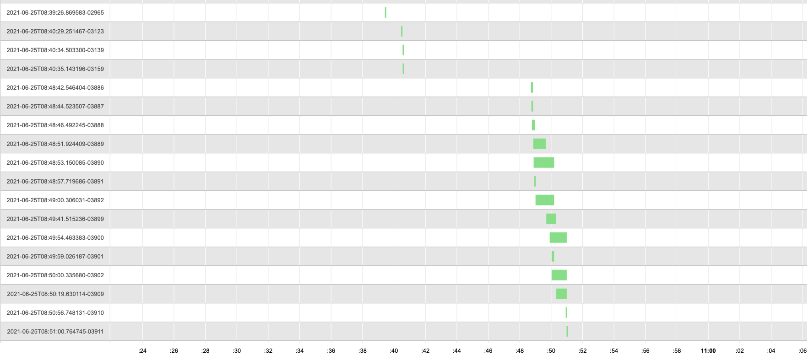

# timelineFromCSV

Convert logs into request timeline diagram

## Manual

```bash
➜ go run main.go --help
  -beginRegex string
        regex that should have a match on beginning message
  -csv string
        input CSV file
  -endRegex string
        regex that should have a match on ending message
  -fieldId string
        which field will be used as ID
  -fieldMsg string
        which field will be used as message
  -fieldTs string
        which field will be used as timestamp
  -templateFile string
        which Go template file should be used to generate output, use Golang syntax: https://golang.org/pkg/time/#ParseDuration (default "template.html")
  -threshold string
        what event length is minimal to consider it (default "1s")
  -tsFormat string
        how to parse the ts field - use Golang syntax: https://golang.org/pkg/time/#Parse
```

## Example

Having input like this (extracted and anonimized output from DD but you should be able to get similar output from your centralized logging service):

```csv
date,Host,Traceid,message
2021-06-23T08:52:58.506Z,server-app,2021-06-23T08:52:58.506613-11843,"Response..."
2021-06-23T08:52:56.952Z,server-app,2021-06-23T08:52:03.302112-11758,"Request received..."
.....
```

If we run the script:

```
go run main.go \
-csv /tmp/extract.csv \
-fieldId "Traceid" \
-fieldTs "date" \
-tsFormat "2006-01-02T15:04:05.999Z" \
-fieldMsg "message" \
-beginRegex "Request received" \
-endRegex "Response"
```

we should get as output HTML similar to this:



Which allows us to experience the timeline of the requests which take longer time or affect other requests
coming in in parallel threads.
